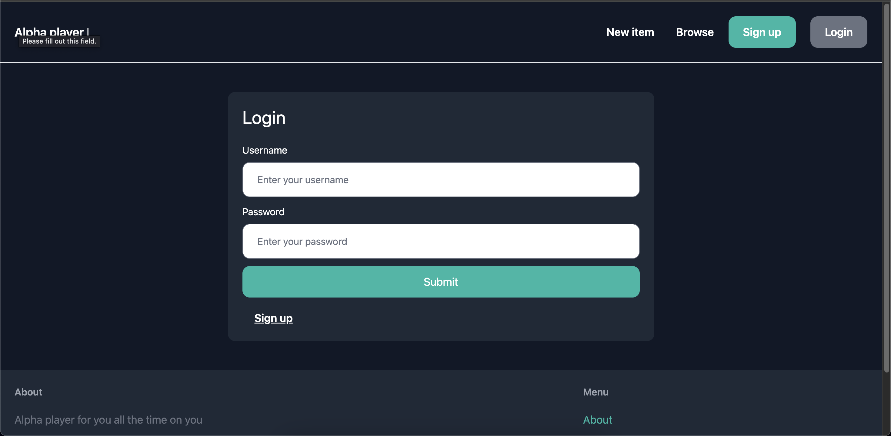
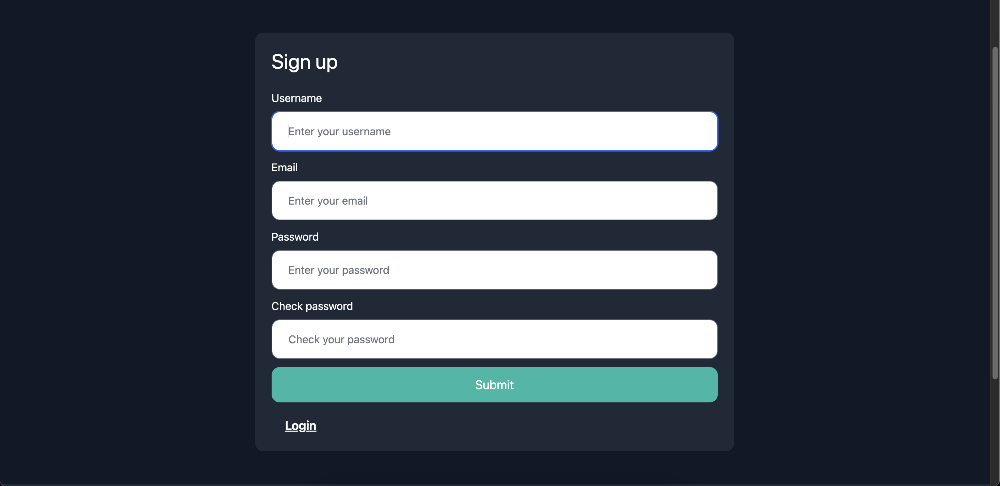
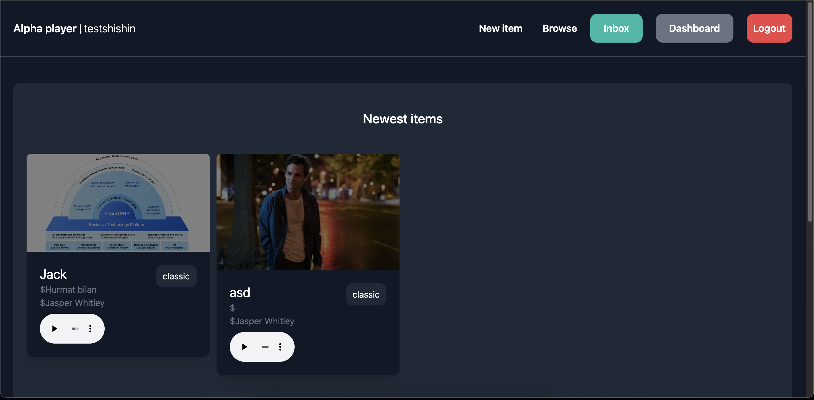
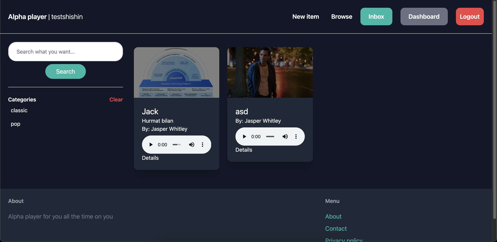
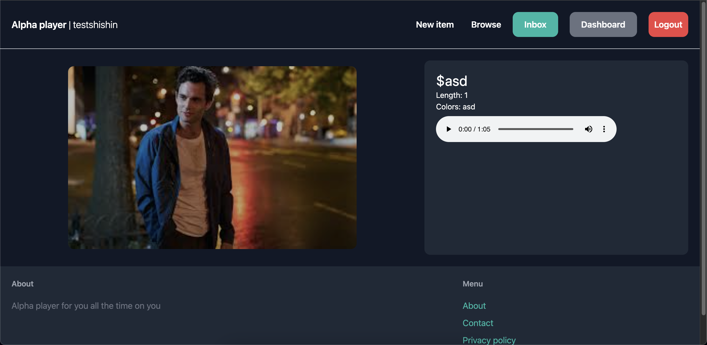

# Setup & Installation

Python 3.10+ – Download Python

Node.js & npm (for Tailwind CSS) – Download Node.js

PostgreSQL (or SQLite for development) – Download PostgreSQL

Git – Download Git

## 1. Clone the Repository

First, open a terminal and run:

```shell
git clone https://github.com/Alpha-team-project/Alpha-player-django.git
```
## 2. Set Up a Virtual Environment

Creating a virtual environment helps manage dependencies.

```shell
python -m venv venv
```
## 3. Install Backend Dependencies

Next, install the required Python packages:
```shell
pip install -r requirements.txt
```

## 4. Set Up Environment Variables

Create a .env file in the root directory and add:
```shell
cp .env.example .env
```
For SQLite (development), you don’t need database settings.

## 5. Apply Database Migrations

Run the following command to create database tables:

```shell
python manage.py migrate
```

## 6. Create a Superuser (Admin Panel Access)

To access the Django Admin panel, create a superuser:

```shell
python manage.py createsuperuser
```
Enter a username, email, and password when prompted.

## 7. Install & Build Tailwind CSS

Tailwind CSS is used for frontend styling.
```shell
python manage.py tailwind build
```
This compiles the CSS whenever you make changes.

## 8. Run the Development Server

Now, start the Django server:

```shell
python manage.py runserver
```
Open http://127.0.0.1:8000/ in your browser.

Now, Alpha Player should be running on your local machine! 🚀


docker-compose up -d --build


# Login page [click to see](https://alpha-player.bahrom04.uz/login/)



# Sign up page [click to see](https://alpha-player.bahrom04.uz/signup/?next=/)



# Dashboard page [click to see](https://alpha-player.bahrom04.uz/login/)



# Browse musics  [click to see](https://alpha-player.bahrom04.uz/items/)



# Music detail page [click to see](https://alpha-player.bahrom04.uz/items/2/)


